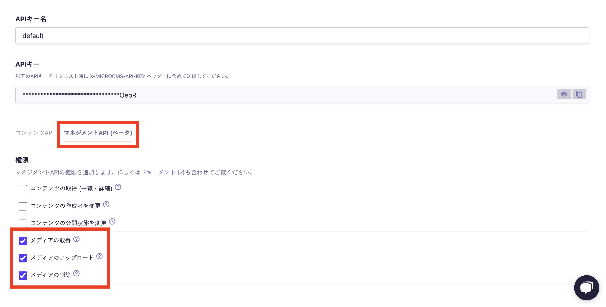

# microcms-entry-nodejs

このリポジトリは、npmコマンドを実行することで、microCMSにPOSTリクエストを送信し、サンプルデータを簡単に作成するためのシンプルなツールです。

開発やテストの際に、手動でコンテンツを登録する手間を省き、コマンド一つで迅速にデータを作成できます。ブログ記事のリストやメディアファイルのアップロードなど、複数の種類のコンテンツ投稿に対応しています。

## Usage

- [pnpm](https://pnpm.io/ja/installation)
- [Node.js](https://nodejs.org/ja/download)

## Setup

1. create `.env`

```
cp .env.sample .env
```

下記の項目を入力してください。

- `MICROCMS_API_KEY` : microCMS 管理画面の「サービス設定 > API キー」から確認することができます。

- `MICROCMS_SERVICE_DOMAIN` : microCMS 管理画面の URL（https://xxxxxxxx.microcms.io）の xxxxxxxx の部分になります。

2. package install

```
pnpm install
```

3. schema import

[こちらのページ](https://document.microcms.io/manual/export-and-import-api-schema
)を参考に microCMS 管理画面で`src/schema`の`json`ファイルをインポートしてAPIスキーマを作成してください。


4. method change allowed

microCMS 管理画面でマネジメントAPIの権限で赤枠の権限を有効にしてください。



## Command

- 全てのサンプルコンテンツがアップロードされます。

```
npm run post:all
```

- ブログ記事などのリスト形式コンテンツがアップロードされます。

```
npm run post:contents
```

- `src/images` のファイルがアップロードされます。

```
npm run post:media
```

- microCMSのメディアとローカルの`src/images`が同期されます。

```
npm run sync:media
```

## Trouble Shot

- APIキーは機密情報です。`.env` ファイルが誤ってリポジトリにコミットしないように注意してください。
- アップロードするメディアファイルの種類やサイズは、microCMSのプランや設定によって制限がある場合があります。
